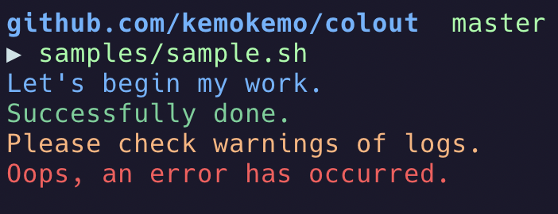

# colout (colored output tool)

[](https://opensource.org/licenses/MIT) [](https://goreportcard.com/report/github.com/kemokemo/colout) [](https://github.com/goreleaser)

It's a simple and tiny tool for getting colored output in scripts.



## Usage

```sh
$ colout -h
A CLI tool that makes it easy to use colored output.

Usage:
  colout [command]

Available Commands:
  error       colored red output
  help        Help about any command
  info        colored blue output
  success     colored green output
  version     Print the version number
  warn        colored yellow output

Flags:
  -h, --help   help for colout

Use "colout [command] --help" for more information about a command.
```

## Examples

### Both args and standard input are available

The subcommands specify the color, and the wording is passed as an argument or standard input.

```sh
colout success "Successfully done."
```

```sh
echo "Successfully done." | colout success
```

All of the above examples result in the following output.


### Shell script

```sh
#!/bin/bash

# do-your-work

if [ $? = 0 ]; then
  colout success "Successfully done."
else
  colout error "An error has occurred."
fi
```

### Power shell

```sh
# do-your-work

if ( $? ){
  colout success "Successfully done."
}
else {
  colout error "An error has occurred."
}
```

### Windows batch

```sh
@echo off

rem do-your-work

if %errorlevel% == 0 (
  colout success "Successfully done."
) else (
  colout error "An error has occurred."
) 
```

## How to install

### Homebrew

```sh
brew install kemokemo/tap/colout
```

### Scoop

First, add my scoop-bucket.

```sh
scoop bucket add kemokemo-bucket https://github.com/kemokemo/scoop-bucket.git
```

Next, install this app by running the following.

```sh
scoop install colout
```

### Build yourself

```sh
go get github.com/kemokemo/colout
```

### Binary

Download from [the release page](https://github.com/kemokemo/colout/releases/latest), unpack the archive and put the binary somewhere in your `PATH`.

## License

[MIT](https://github.com/kemokemo/colout/blob/master/LICENSE)

## Author

[kemokemo](https://github.com/kemokemo)

